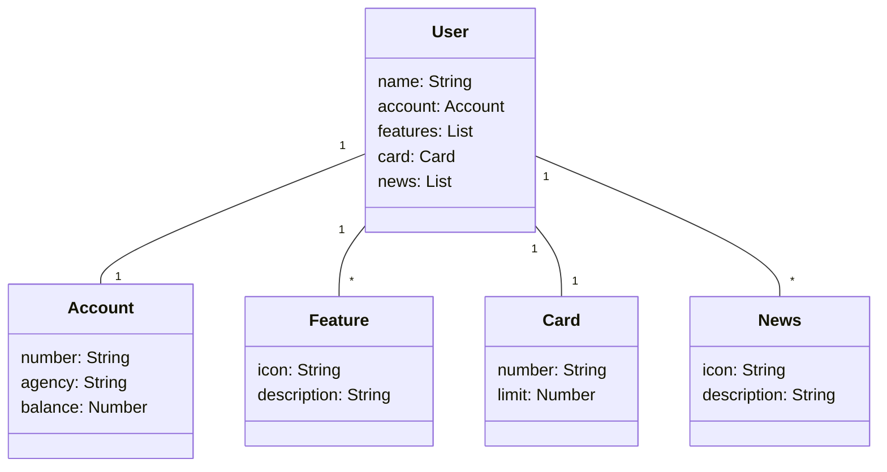

## Diagrama de Classes

```mermaid
classDiagram
  class User {
    name: String
    account: Account
    features: List<Feature>
    card: Card
    news: List<News>
  }

  class Account {
    number: String
    agency: String
    balance: Number
  }

  class Feature {
    icon: String
    description: String
  }

  class Card {
    number: String
    limit: Number
  }

  class News {
    icon: String
    description: String
  }

  User "1" -- "1" Account
  User "1" -- "*" Feature
  User "1" -- "1" Card
  User "1" -- "*" News
```
